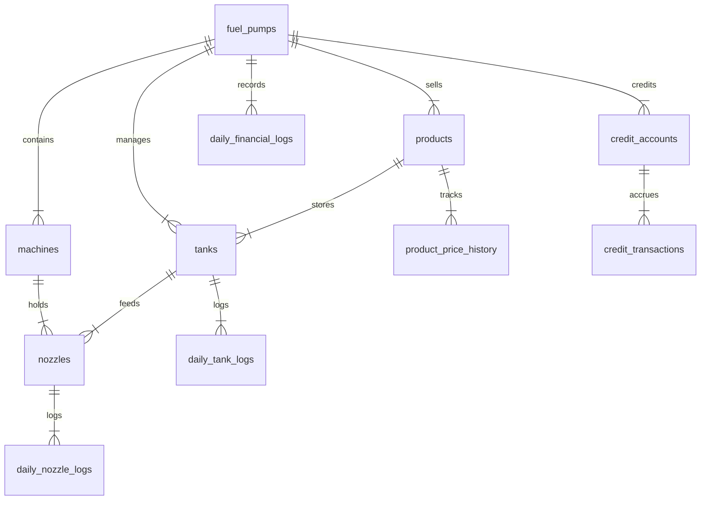

# PumpKhata ⛽📊

**PumpKhata** is a proprietary, closed-loop Fuel Pump Management System designed for multi-pump fuel station firms in India. The system completely eliminates manual pen-and-paper tracking, migrating daily operations to a secure, digital enterprise ledger.

Developed as a mobile-first, cross-platform Progressive Web Application (PWA), PumpKhata optimizes physical stock auditing, multi-product dispenser configurations, daily shift reconciliations, B2B credit ledger tracking, and automated monthly business intelligence reporting.

---

## 🏗️ Domain & Hierarchy Structure

PumpKhata maps physical fuel station environments into a hierarchical domain tree:

```
[Organization]
 └── [Fuel Pump Station]
      ├── [Tank] ── (Stores a specific product type, e.g., Petrol)
      └── [Machine] (Physical dispenser casing on the island)
           ├── [Nozzle 1] ──> Draws from Tank A
           └── [Nozzle 2] ──> Draws from Tank B
```

* **Machine**: Grouping container for dispensing nozzles.
* **Nozzle**: The specific outlet connected to an underground tank. Daily readings and logs are tracked at the **Nozzle level**, not the Machine level.
* **Tank**: Underground reservoir with a defined maximum capacity. Tracks wet-stock inventory and variance.

---

## 🚀 Core Features (Epics)

### 1. Secure Access Control & Auth (Epic 1)
* **Unified Login**: Secure credentials validation over TLS/HTTPS.
* **Session Management**: JWT-based authentication tokens stored in secure, `HttpOnly`, `SameSite` cookies with auto-invalidation after inactivity.
* **Data Protection**: Zero plaintext passwords; adaptive `bcrypt` hashing before database persistence.

### 2. Master Data Management / MDM (Epic 2)
* **Configuration CRUD**: Owner interface to provision stations, tanks, machines, and individual nozzles.
* **Soft Deletes**: Deleting machines or nozzles toggles an `is_active = false` flag to ensure historical ledger and fiscal closing data integrity are preserved.
* **Dynamic Pricing**: Dynamic price and cost margin updates per liter. Price histories are timestamped to ensure historical log reconciliations utilize the rate active at that specific time.

### 3. Daily Shift Log & Meter Tracking (Epic 3)
* **Auto-Population**: Opens nozzle logs with the previous day's closing readings.
* **Rollover Logic**: Detects meter rollovers/resets via an authenticated "Meter Reset" flag when closing reading < opening reading.
* **Calibration Deductions**: Subtracts non-revenue calibration "Testing Liters" (which are poured back into the source tank) from sales metrics.
* **Wet-Stock Audits**: Demands actual dip-rod/sensor physical stock readings at shift closing to match against expected book stock.

### 4. Credit Accounts & B2B Ledger (Epic 4)
* **B2B Ledger**: Maintains client buyer profiles with real-time outstanding balances.
* **Credit Sales**: Allows portion of daily shift revenue to be logged as a credit sale, instantly incrementing the customer's pending debt.
* **Payment Log**: Captures partial or full payments clearing outstanding buyer debts.

### 5. Daily Financial Reconciliation (Epic 5)
* **Net-Sales expectation**: Expected revenue is calculated strictly using net volume sold (gross liters sold minus testing liters).
* **Payment Split**: Records cash collected versus digital collections (Paytm/UPI/Credit Card).
* **Overage/Shortage Audits**: Automatically compares collected cash/digital/credit aggregates against expected net revenue targets, flagging variances.
* **Safe Rollover**: Rolls over closing physical cash as the starting balance for the next shift's cash pool.

### 6. Business Intelligence & Reports (Epic 6)
* **Monthly Operations Statements**: Generates location-specific or consolidated fleet summaries.
* **Metrics Tracked**: Net & gross volumes, gross revenue, net profit margins, B2B credit aging balances, and cumulative tank variances.
* **Exporting**: Directly export views into print-ready PDF vectors or raw CSV data.

---

## 🧮 Core Operational Formulas

### 1. Nozzle Metering
$$\text{Gross Liters Sold} = \text{Closing Reading} - \text{Opening Reading}$$
$$\text{Net Liters Sold} = \text{Gross Liters Sold} - \text{Testing Liters}$$

### 2. Wet-Stock Inventory Reconciliation
$$\text{Expected Book Stock} = \text{Yesterday's Closing Physical Stock} + \text{Fuel Received Today} - \sum(\text{Gross Liters Dispensed via connected nozzles})$$
$$\text{Variance} = \text{Actual Physical Stock (Sensor/Dip)} - \text{Expected Book Stock}$$
*(Note: Negative variance exceeding a $1\%$ threshold is flagged as a critical operational shortage)*

### 3. Financial Reconciliation
$$\text{Expected Revenue} = \sum(\text{Net Liters Sold per Nozzle} \times \text{Selling Price of linked product})$$
$$\text{Daily Financial Balance Equation} \implies \text{Expected Revenue} = \text{Cash Collected} + \text{Digital Payments (Paytm/UPI/Cards)} + \text{Credit Sales Logged}$$
$$\text{Total Shift Cash Asset Pool} = \text{Opening Cash Balance (Today)} + \text{Cash Collected Today}$$

---

## 🗄️ Database Schema Design

Optimized for high write-concurrency, PostgreSQL transactional logs are separated across distinct relational tables:



### 1. Infrastructure Tables
* **`fuel_pumps`**: `id`, `name`, `location`, `is_active`
* **`products`**: `id`, `fuel_pumps_id`, `name`, `current_price`, `current_margin`
* **`product_price_history`**: `id`, `product_id`, `selling_price`, `valid_from`, `valid_to`
* **`tanks`**: `id`, `pump_id`, `product_id`, `name`, `max_capacity`
* **`machines`**: `id`, `pump_id`, `name`, `number_of_nozzles`
* **`nozzles`**: `id`, `machine_id`, `tank_id`, `name`, `is_active`

### 2. Operational Tables
* **`daily_nozzle_logs`**: `id`, `nozzle_id`, `log_date`, `log_timestamp`, `opening_reading`, `closing_reading`, `is_reset`, `gross_liters_sold`
* **`daily_tank_logs`**: `id`, `tank_id`, `log_date`, `log_timestamp`, `testing_liters`, `fuel_received`, `actual_dip_volume`, `calculated_variance`

### 3. Financial & Credit Tables
* **`credit_accounts`**: `id`, `pump_id`, `account_name`, `current_outstanding_balance`
* **`credit_transactions`**: `id`, `account_id`, `log_date`, `log_timestamp`, `type` (restricted to `'CHARGE'` or `'PAYMENT'`), `amount`, `notes`
* **`daily_financial_logs`**: `id`, `pump_id`, `log_date`, `log_timestamp`, `opening_cash_balance`, `expected_revenue`, `cash_collected`, `digital_collected`, `credit_sales_logged`, `closing_cash_balance`, `shortage_overage`

---

## 🛠️ Technology Stack

* **Frontend**: React + TypeScript + Vite + Tailwind CSS v4.
* **Backend**: Python 3.11+ + FastAPI (asynchronous, auto-documented JSON endpoints).
* **Database**: PostgreSQL (relational schemas optimized for transactional write performance).

---

## 🔒 Security & Deployment Architecture

To protect highly sensitive financial ledger data, PumpKhata relies on network-level perimeter isolation:
1. **Private Mesh Network (Tailscale)**: Decouples server instances from public DNS routing. Client devices (authorized laptops, smartphones) must be authenticated overlay network nodes to access the API.
2. **Reverse Proxy Control**: Upstream Nginx proxies enforce IP Whitelist block policies alongside secure JWT cookie checks.

---

## 📁 Repository Layout

```
├── docs/                      # PDF design and requirements documentation
├── backend/                   # FastAPI Python server application
│   ├── app/                   # Backend routes, database setup & services
│   └── requirements.txt       # Python package dependencies
├── frontend/                  # React + Vite + Tailwind CSS v4 application
│   ├── src/                   # React components and dashboard views
│   ├── vite.config.ts         # Vite configuration
│   └── package.json           # Node.js dependencies
└── README.md                  # This file
```

---

## 🔌 Running Locally

### Prerequisites
* Python 3.11+
* Node.js v22.12+ (or v24.x LTS)
* PostgreSQL Database

### 1. Setting up the Backend
```bash
cd backend
python -m venv .venv
source .venv/bin/activate
pip install -r requirements.txt
# Configure database settings in environment variables or .env
uvicorn app.main:app --reload
```

### 2. Setting up the Frontend
```bash
cd frontend
npm install
npm run dev
```
